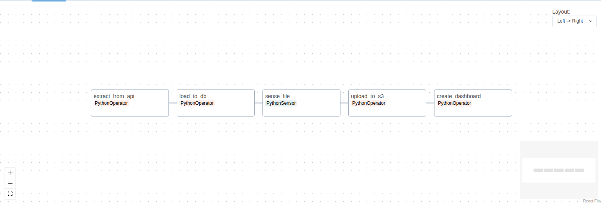

# Reddit Data Engineering ETL Pipeline 

This project is a complete ETL (Extract, Transform, Load) pipeline built to analyze data from the r/dataengineering subreddit. It uses Apache Airflow for orchestration, Docker for containerization, and various Python scripts for data handling and analysis.

---

##  Features

* **Data Extraction**: Fetches the top posts from the r/dataengineering subreddit using the Reddit API (PRAW).
* **Data Storage**: Loads the extracted data into a PostgreSQL database for querying and analysis.
* **Data Archiving**: Backs up the processed data files to an AWS S3 bucket.
* **Orchestration**: Manages the entire workflow using an Apache Airflow DAG.
* **Analysis & Visualization**: Generates an interactive HTML dashboard with Plotly to visualize insights from the data.
* **Containerized**: The entire application stack (Airflow, PostgreSQL) is containerized using Docker and Docker Compose for easy setup and portability.

---

##  Tech Stack

* **Orchestration**: Apache Airflow
* **Containerization**: Docker & Docker Compose
* **Data Storage**: PostgreSQL
* **Cloud Storage**: AWS S3
* **Data Processing**: Python, Pandas
* **Data Source**: Reddit API (PRAW)
* **Visualization**: Plotly

---

## Project Structure

```

.
├── config/             \# Configuration files (e.g., database credentials)
├── dags/               \# Airflow DAG definitions
│   └── main\_dag.py
├── data/               \# Temporary storage for extracted CSV files
├── etls/               \# ETL scripts for each step of the pipeline
│   ├── main\_etl.py     \# E: Extract from Reddit
│   ├── psql\_load.py    \# L: Load to PostgreSQL
│   └── s3\_etl.py       \# L: Load to S3
├── logs/               \# Airflow logs
├── plugins/            \# Airflow plugins, including the analytics dashboard script
│   ├── analytics.py
│   └── dashboards.html \# Generated dashboard
├── .env                \# Environment variables for Docker and credentials
├── Dockerfile          \# Docker build instructions for the Airflow image
└── docker-compose.yaml \# Defines and configures all services

````




---

##  Pipeline Workflow

The main Airflow DAG (`reddit_ETL`) orchestrates the following tasks in sequence:

1.  **Extract from API**: Runs `main_etl.py` to fetch data from Reddit and save it as a CSV file in the `/data` directory.
2.  **Load to DB**: Executes `psql_load.py` to load the CSV data into the `reddit_posts` table in PostgreSQL. It renames the file with a `.done` extension upon success.
3.  **Sense File**: A sensor waits to confirm that the `.done` file has been created, ensuring the database load is complete before proceeding.
4.  **Upload to S3**: Triggers `s3_etl.py` to upload the `.done` file to an S3 bucket for long-term storage and then deletes the local copy.
5.  **Create Dashboard**: Runs `analytics.py` to query the PostgreSQL database and generate a `dashboards.html` file with Plotly visualizations.

---

## Setup and Installation

1.  **Clone the Repository**
    ```bash
    git clone <your-repository-url>
    cd <repository-name>
    ```

2.  **Configure Environment Variables**
    Create a `.env` file in the root directory and add your credentials. You can use the `airflow.env` file as a template.

    **`.env` file:**
    ```env
    # Reddit API Credentials
    REDDIT_CLIENT_ID="your_client_id"
    REDDIT_CLIENT_SECRET="your_client_secret"
    REDDIT_USERNAME="your_reddit_username"
    REDDIT_PASSWORD="your_reddit_password"

    # AWS Credentials
    S3_ACCESS_KEY="your_aws_access_key"
    S3_SECRET_ACCESS_KEY="your_aws_secret_key"

    # PostgreSQL Credentials
    POSTGRES_USERNAME="airflow"
    POSTGRES_PASSWORD="airflow"
    ```
    *Note: You may also need to place credentials in a `.conf` file inside the `config/` directory as used by the `analytics.py` script.*

3.  **Build and Run with Docker Compose**
    From the root directory, run the following command to build the custom Airflow image and start all services.

    ```bash
    docker-compose up -d --build
    ```

4.  **Access Airflow & Dashboard**
    * **Airflow UI**: Open your web browser and go to `http://localhost:8080`. The default login is `airflow` / `airflow`.
    * **Dashboard**: After a successful DAG run, the generated dashboard can be found in the `plugins/dashboards.html` file on your local machine.